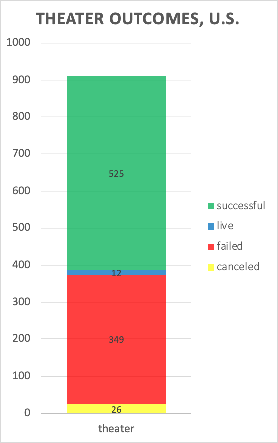
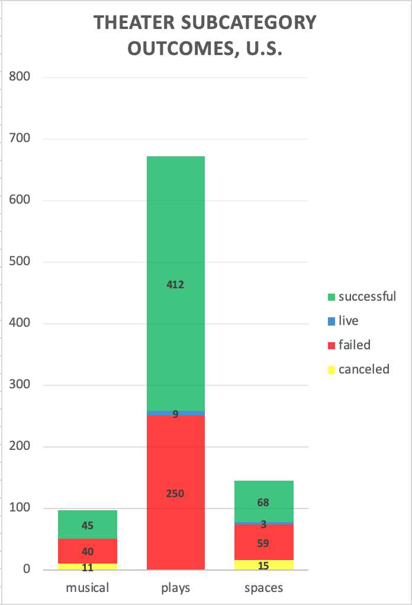
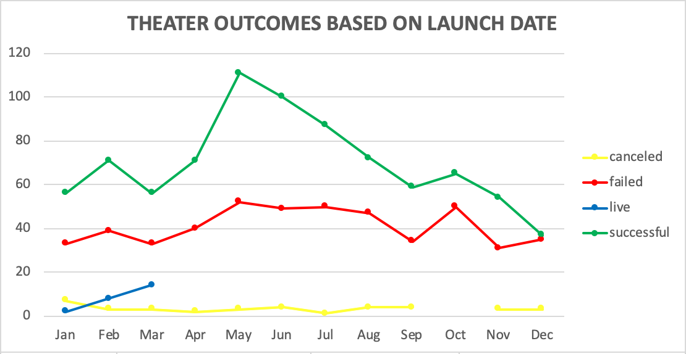
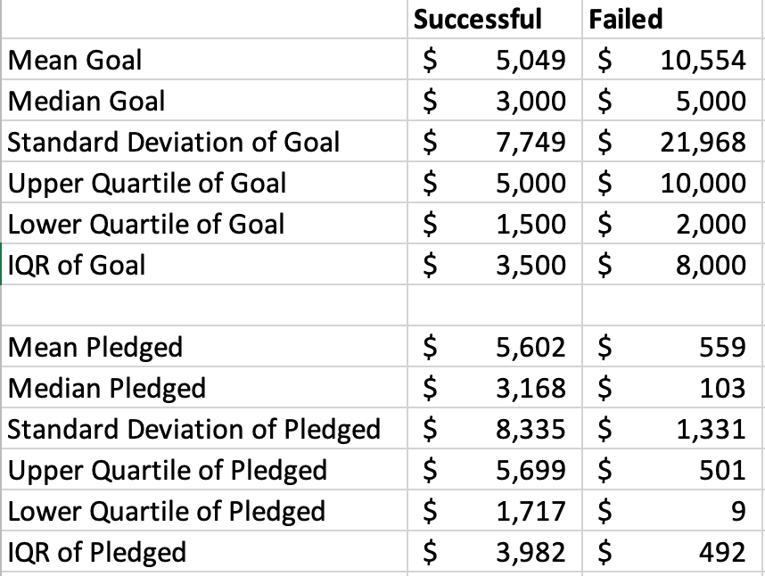
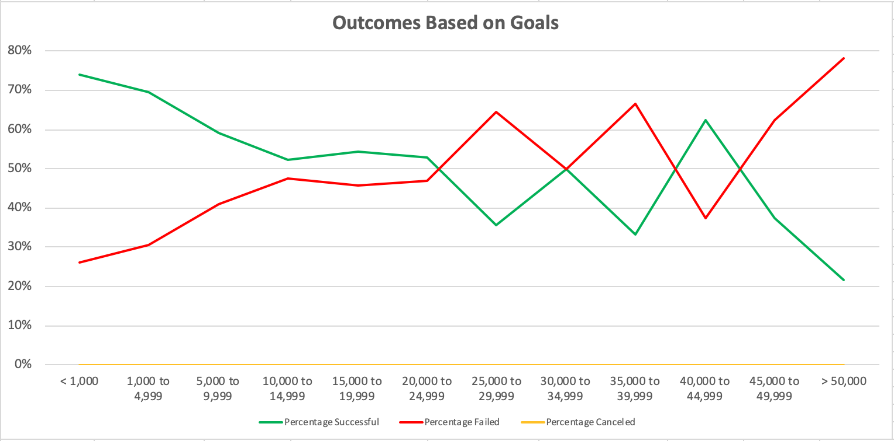
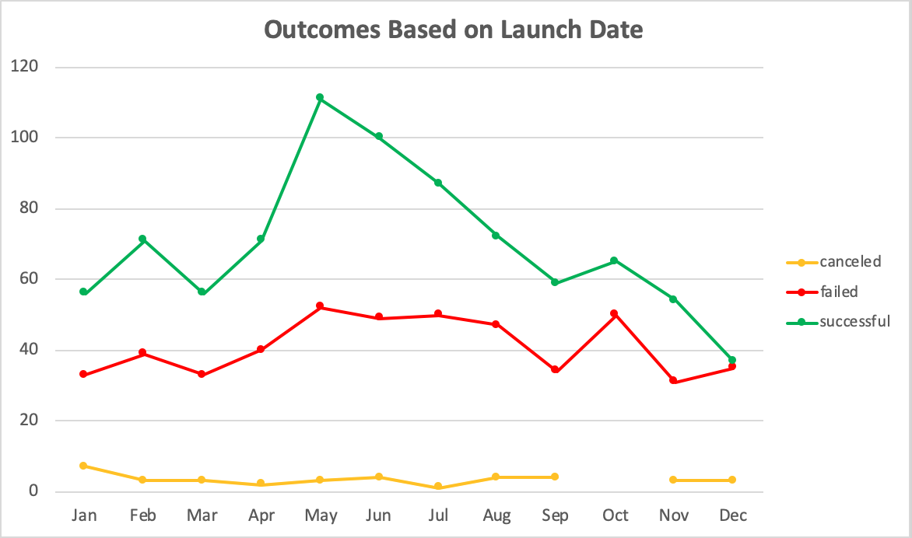
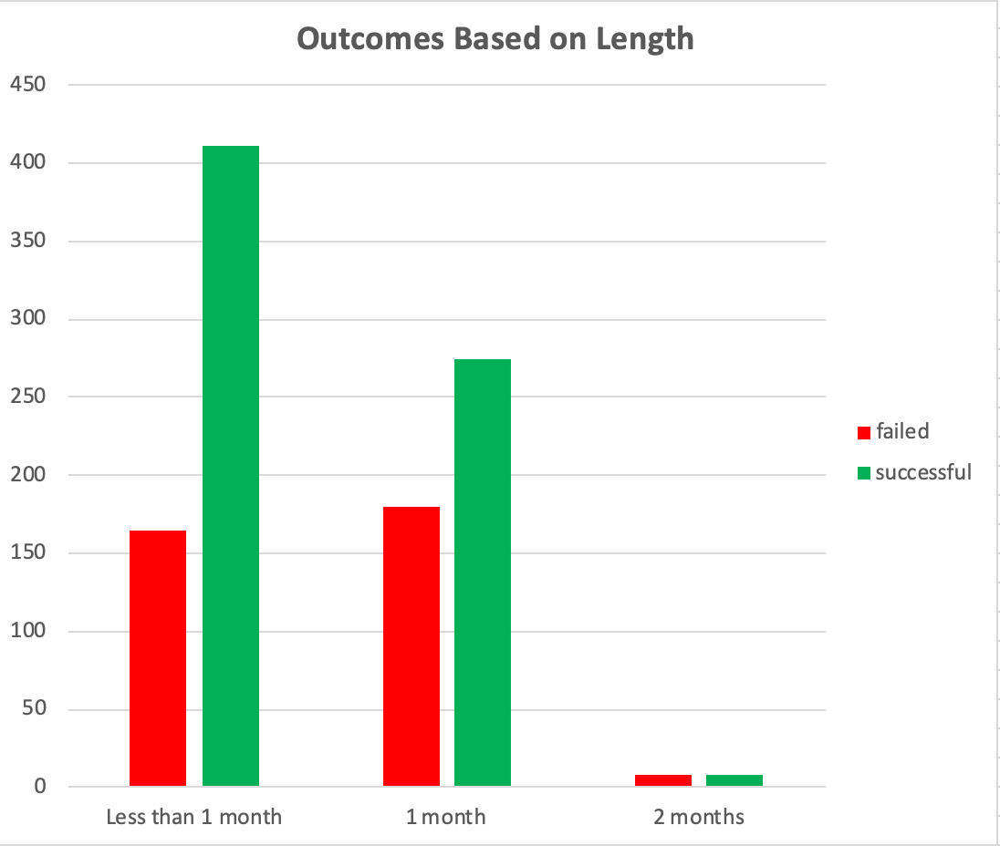

# An Analysis of Kickstarter Campaigns
An analysis was performed using Kickstarter data to help inform Louise about crowdfunding campaigns, and what factors may help her have a successful campaign for her play "Fever" with a $10,000 budget. 

Kickstarter data demonstarted that there has been a total of 912 theater campaigns in the United States. Among these theater campaigns, 525 (58%) were successful campaigns and 349 (38%) were failed campaigns. There were also 12 campaigns that were currently active and 26 campaigns that were cancelled. 

Theaters in the U.S. were stratisfied into musicals, plays, and spaces. Plays contributed to theater kickstarters the most, followed by spaces then musicals. Among the 671 "play" kickstarters, 412 (61%) were successful and 250 (37%) failed.

Knowing which season and/or month to launch a kickstarter may be key to success. Data shows that successful theater campaigns were launched during late Spring/early Summer (May-June), whereas failed campaignes were launched during the Winter (December).

Some statistics comparing successful and failed "play" kickstarters in the United States demonstrate that a $10,000 budget could be of concern for Louise. The average goal among successful kickstarters was about $5,000, which is about half of Louise's budget. Failed campaigns' goals averaged to be about $10,000.

Major takeaways:
* Both theater and play kickstarters have shown success in the U.S. Louise should pursue a "play" Kickstarter.
* Kickstarters launched in May/June have been more successul than those launched in December. Louise's "Fever" play should be launched sometime late Spring/early Summer.
* Ambition goals may not lead to successful kickstarter. Louise should consider reducing her Kickestarter goals.

---

### Challenge
Kickstarter data provided insight into outcomes relating to play campaigns. In particular, two goal ranges were used to compare outcomes for Louise’s $10,000 goal: $5,000-$9,999 and $10,000-$14,999.

There were 65 plays in the $10,000-$14,999 goal range that were successful and 230 plays in the $5,000-$9,9999 goal range that were successful. Chances of success were at 52% and 59%, respectively. In addition, 59 plays in the $10,000-$14,999 goal range that failed and 160 plays in the $5,000-$9,9999 goal range that failed. Chances of failure were at 48% and 41%, respectively. Given Louise’s play outcomes, her goals were consistent with data showing her chances of success and failure. It turned out that Louise’s play had greater chances of reaching a goal of $5,000-$9,999 (59%), and greater chances of failing to reach her goal of at least $10,000 (48%).

One reason Louise’s play fell short of her goal could be due to when she launched her campaign. She may have launched her campaign in a month other than May or June given that Kickstarter data showed that successful campaignes were launched during these two months. There were 111 successful campaigns launched in May and 100 successful campaigns launched in June.

Another reason could be due to length of her campaign. Some further analysis revealed that shorter Kickstarters are more successful. Campaign that are less than four weeks long are more successful than campaigns that are four or more weeks long. Among the 694 successful campaigns, 411 (59%) were less than a month and 275 (40%) were at least a month. Given that Louise’s play came close to its goal in a short amount of time, there may be another factor that may have led to her shortcomings. It is also important to define short time since there were several campaigns that were one week or two weeks long vs. three weeks or four weeks.

The dataset included several Kickstarters that were still alive during analysis. This may be a limitation since that data could not be used to determine success or failure. It would be interesting to obtain additional information on the average donation in relation to launch date, and whether timing could have affected how much a backer was able to donate. Displaying this information using a line graph could help visualize time periods in which backers are most generous. Another suggestion would be to include average donation in relation to length of campaigns. Perhaps this could uncover a factor to why Louise could not reach her goal.
